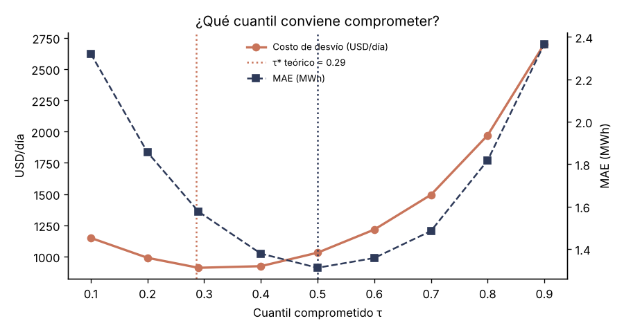

# Guía de clase — Pronóstico eólico con dinero en juego

**Duración sugerida:** 2 h · **Prerrequisito:** Liga Solar (API de XM, flujo fork → PR) y la sesión de
CAPEX/OPEX con el Agente Eólico.

| Tiempo | Bloque | Qué pasa |
|---|---|---|
| 0:00–0:15 | **Gancho** | Mostrar `LEADERBOARD.md`. Pregunta: *"Mañana a las 7 p. m., ¿cuántos MWh van a comprometer de Guajira I? Si fallan, pagan."* Que cada uno apueste un número. |
| 0:15–0:30 | **XM para eólica** | En Colab: `ReadDB().request_data("ListadoRecursos","Sistema",…)` → filtrar `VIENTO`. ¿Cuántos parques eólicos reporta XM? (Spoiler: casi solo Guajira I.) Discutir por qué La Guajira tiene 16 proyectos y casi nada operando. |
| 0:30–0:50 | **La física: curva de potencia** | `modelos/curva_potencia.py`: generación vs viento a 80 m. Arranque (~3 m/s), zona cúbica, nominal, corte. Conectar con la lámina de la N60 y con la curva empírica del Agente Eólico v4. |
| 0:50–1:15 | **El giro: el puntaje es dinero** | `liga/mercado.py`. Mostrar el leaderboard: el mejor MAE no gana. Correr `python -m experimentos.cuantil_optimo` y ver la U del costo con mínimo en τ ≈ 0,29 mientras el MAE tiene mínimo en 0,5. Derivar en el tablero el *vendedor de periódicos*: τ* = α_exc / (α_exc + α_falt). |
| 1:15–1:30 | **GitHub como laboratorio** | Fork → nuevo archivo en `modelos/` → PR → *Actions* valida → merge. |
| 1:30–1:50 | **Manos a la obra** | En parejas: un reto de la lista. Probar con `--demo --backtest 7`. Abrir el PR antes de salir. |
| 1:50–2:00 | **Claude como analista** | En un issue: `@claude ¿en qué horas pierde más plata la persistencia y por qué?` |

## Retos (de menor a mayor)
1. **Persistencia inteligente:** promedio de los últimos 3 días a cada hora. ¿Le gana a la persistencia en dólares?
2. **Curva de potencia por sectores:** una curva por sector de dirección (por ejemplo, de 30°). Los alisios
   vienen del noreste; ¿qué pasa cuando el viento rota?
3. **Detectar paradas:** si ayer el parque generó mucho menos de lo que la curva predice con ese viento, hay
   turbinas fuera de servicio. Escala el compromiso de mañana por esa disponibilidad.
4. **Comprometer el cuantil correcto:** toma tu mejor modelo de la media y conviértelo en cuantil 0,29
   (pinball loss, regresión cuantílica o restar un margen calibrado). Mide MAE y USD antes y después.
5. **Ponderar por precio:** entrena con `sample_weight` = precio de bolsa de cada hora. ¿Ayuda? ¿Por qué el
   precio de mañana NO cambia el cuantil óptimo, pero sí cambia en qué horas conviene acertar?
6. **Pro:** red neuronal (GRU o MLP) con pérdida pinball que prediga los cuantiles 0,1–0,29–0,5–0,9. Revisa
   la cobertura del intervalo 10–90 y calíbralo con *conformal prediction*.

## Preguntas de discusión
- ¿Por qué el modelo con mejor MAE no gana la liga? ¿Qué cambiaría si faltar y sobrar costaran lo mismo?
- Si en la madrugada el viento es máximo y la bolsa es barata, ¿en qué horas vale la pena invertir en acertar?
- ¿Por qué se excluyen los días con el parque totalmente parado? ¿Es justo?
- Guajira I tiene 20 MW. ¿Cuánto costarían estos errores para un parque como Alpha (212 MW)? Conecten con el
  OPEX y el riesgo de "sobrestimar la energía" de la sesión de CAPEX/OPEX.

## Antes de la clase (profe, 10 min)
1. Crear el repo en GitHub y subir esta carpeta.
2. *Actions* → *🌬️ Pronóstico eólico diario* → **Run workflow** con `backtest = 14` para que el
   leaderboard ya tenga datos. Revisar en el log que XM encontró el recurso eólico (línea `XM: recursos eólicos →`).
3. (Opcional) *Settings → Secrets → Actions*: `ANTHROPIC_API_KEY` para habilitar `@claude`.

*Barrido con datos de juguete (`--demo`, 10 días): el costo mínimo cae en τ = 0,29 y el MAE mínimo en τ = 0,50.*
