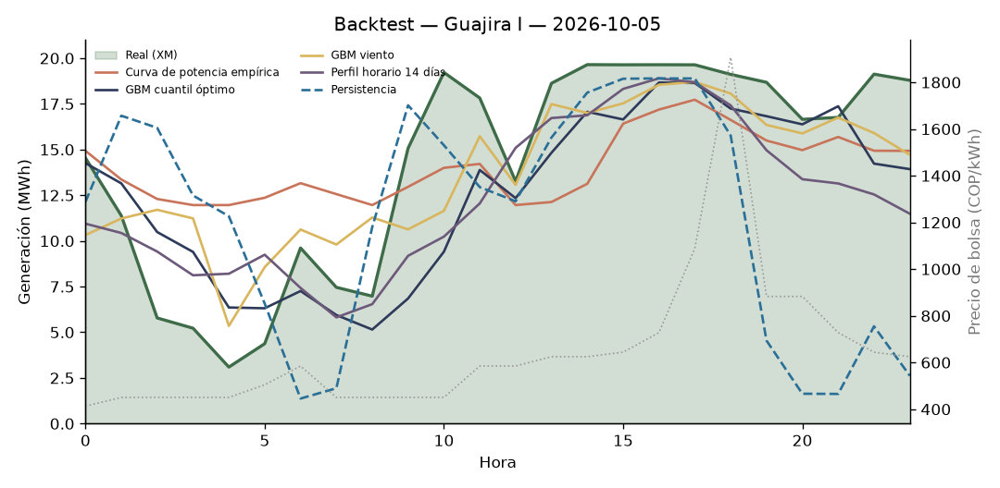

# 🌬️ Liga de Pronóstico Eólico Colombia — Leaderboard

_Actualizado: 2026-10-09 12:51 (hora Colombia) · Parque: **Guajira I** (20 MW) · Gana quien **pierde menos dinero por desviaciones**: faltar cuesta 50% del precio de bolsa, sobrar cuesta 20% · TRM 3,800 · Cuantil óptimo teórico ≈ 0.29_

## 🏆 Liga oficial (compromisos hechos ANTES de conocer el dato real)

_Aún no hay días calificados: XM publica con 1-2 días de rezago._

## 🧪 Backtest (días pasados, para arrancar en frío)

_Ojo: en el backtest el 'pronóstico' de viento es casi el viento observado → resultados optimistas._

| # | Modelo | Autor | Días | 💵 Costo de desvío (USD/día) | % del valor de la energía | Skill $ vs persistencia | MAE (MWh) | Sesgo (MWh) |
|---|---|---|---|---|---|---|---|---|
| 🥇 | GBM cuantil óptimo | profe | 14 | 3,415 | 5.8% | +46.4% | 2.87 | -0.83 |
| 🥈 | GBM viento | profe | 14 | 3,854 | 6.5% | +39.5% | 2.74 | +0.26 |
| 🥉 | Curva de potencia empírica | profe | 14 | 4,052 | 6.9% | +36.4% | 3.14 | -0.29 |
| 4 | Perfil horario 14 días | profe | 14 | 5,592 | 9.5% | +12.2% | 3.55 | +1.69 |
| 5 | Persistencia | profe | 14 | 6,369 | 10.8% | — | 4.57 | +0.63 |

**Cómo leer la tabla:** el *sesgo* negativo significa que el modelo compromete menos de lo que genera. Con estas reglas eso **conviene** un poco: faltar castiga más que sobrar.
