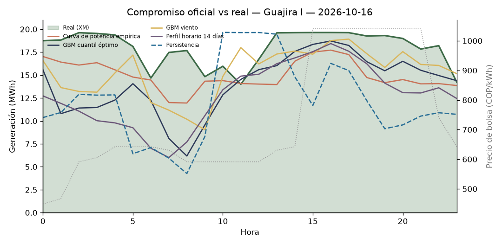
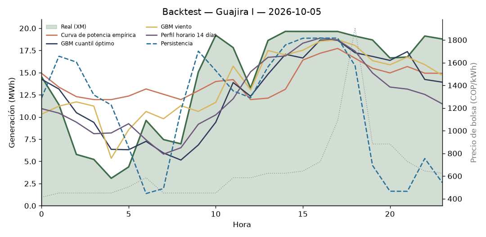

# 🌬️ Liga de Pronóstico Eólico Colombia — Leaderboard

_Actualizado: 2026-10-12 15:44 (hora Colombia) · Parque: **Guajira I** (20 MW) · Gana quien **pierde menos dinero por desviaciones**: faltar cuesta 50% del precio de bolsa, sobrar cuesta 20% · TRM 3,800 · Cuantil óptimo teórico ≈ 0.29_

## 🏆 Liga oficial (compromisos hechos ANTES de conocer el dato real)

| # | Modelo | Autor | Días | 💵 Costo de desvío (USD/día) | % del valor de la energía | Skill $ vs persistencia | MAE (MWh) | Sesgo (MWh) |
|---|---|---|---|---|---|---|---|---|
| 🥇 | GBM cuantil óptimo | profe | 1 | 3,334 | 4.6% | +50.8% | 3.24 | -3.00 |
| 🥈 | GBM viento | profe | 1 | 4,153 | 5.7% | +38.7% | 3.44 | -2.22 |
| 🥉 | Perfil horario 14 días | profe | 1 | 4,758 | 6.5% | +29.8% | 2.88 | +0.19 |
| 4 | Curva de potencia empírica | profe | 1 | 5,615 | 7.7% | +17.1% | 3.83 | -1.01 |
| 5 | Persistencia | profe | 1 | 6,773 | 9.3% | — | 3.63 | +1.89 |

## 🧪 Backtest (días pasados, para arrancar en frío)

_Ojo: en el backtest el 'pronóstico' de viento es casi el viento observado → resultados optimistas._

| # | Modelo | Autor | Días | 💵 Costo de desvío (USD/día) | % del valor de la energía | Skill $ vs persistencia | MAE (MWh) | Sesgo (MWh) |
|---|---|---|---|---|---|---|---|---|
| 🥇 | GBM cuantil óptimo | profe | 14 | 3,390 | 5.8% | +46.4% | 2.85 | -0.80 |
| 🥈 | GBM viento | profe | 14 | 3,832 | 6.6% | +39.4% | 2.72 | +0.29 |
| 🥉 | Curva de potencia empírica | profe | 14 | 4,027 | 6.9% | +36.4% | 3.11 | -0.26 |
| 4 | Perfil horario 14 días | profe | 14 | 5,566 | 9.6% | +12.0% | 3.52 | +1.73 |
| 5 | Persistencia | profe | 14 | 6,328 | 10.9% | — | 4.55 | +0.66 |

**Cómo leer la tabla:** el *sesgo* negativo significa que el modelo compromete menos de lo que genera. Con estas reglas eso **conviene** un poco: faltar castiga más que sobrar.
